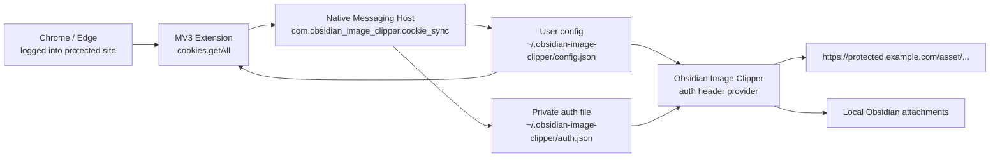

# Obsidian Image Clipper

English | [中文](./README_zh-CN.md)

Authenticated image localization for Obsidian notes clipped from protected sites or internal knowledge bases. This project is a fork-style integration based on [Local Images Plus](https://github.com/Sergei-Korneev/obsidian-local-images-plus), with an added browser Cookie sync pipeline and exact-domain authenticated downloading.

## Start Here

For a release install, start with [Quick start](./docs/quickstart.md). The first public release supports macOS with Chrome or Microsoft Edge only.

The short path is:

1. Download the GitHub Release artifact.
2. Load `browser-extension/` as an unpacked Chrome or Edge extension.
3. Install the macOS Native Messaging host with the loaded extension ID.
4. Install `obsidian-image-clipper/` into your vault.
5. Open a protected page, add its current hostname, grant access, and refresh cookies.
6. Run Obsidian diagnostics on a protected image URL, then localize images.

## What It Solves

Obsidian Web Clipper can preserve protected article images as remote links such as:

```text
https://protected.example.com/asset/...
```

Those images require an active browser login session. A normal Obsidian plugin download request does not automatically include browser cookies, so the request may be redirected to a login page and the plugin receives HTML instead of image bytes.

This project solves that by:

- Reading cookies for the configured protected domains from Chrome/Edge after the user has logged in.
- Writing those cookies to a local private auth file through a Native Messaging host.
- Letting the Obsidian plugin inject those headers only for exact configured domains.
- Rejecting HTML/login responses before they are written as attachments.
- Preserving Local Images Plus behavior for public images, attachment folders, MD5 naming, retries, and note link replacement.

## Project Docs

- [Quick start](./docs/quickstart.md)
- [Uninstall](./docs/uninstall.md)
- [Contributing](./CONTRIBUTING.md)
- [Security policy](./SECURITY.md)
- [Changelog](./CHANGELOG.md)
- [Architecture](./docs/architecture.md)

## Repository Layout

```text
.
├── apps/
│   ├── browser-extension/     # Chrome/Edge Manifest V3 extension
│   ├── native-host/           # macOS Native Messaging host
│   └── obsidian-plugin/       # Obsidian plugin fork based on Local Images Plus
├── packages/
│   └── shared/                # Auth schema, validation, domain matching, response checks
├── scripts/                   # Build/install helpers
├── tests/                     # Vitest unit tests
└── dist/                      # Built runtime artifacts and release package
```

## Architecture



The browser extension cannot silently write arbitrary local files. Chrome/Edge extensions must use Native Messaging for this kind of local integration. That is why the project has three runtime pieces:

- Browser extension: reads cookies for the configured exact domains.
- Native host: validates and writes the central user config plus the local auth file with restrictive permissions.
- Obsidian plugin: reads the central user config, then reads the auth file and uses it during image localization.

## Security Model

The implementation is intentionally narrow:

- Only exact host matching is supported. No protected domains are configured by default; the UI placeholder `protected.example.com` is only a format hint.
- No wildcard domains are accepted.
- The extension asks Chrome/Edge for host permission only for the configured exact domains.
- When opened from a normal `http` or `https` page, the extension can prefill the current page hostname, but it is not saved until you click an add/save action.
- User-facing settings live in one file by default:

```text
~/.obsidian-image-clipper/config.json
```

- Cookie values are not stored in Obsidian settings, vault notes, plugin source, or logs.
- The auth file lives outside the vault by default:

```text
~/.obsidian-image-clipper/auth.json
```

- The native host writes the auth file with `0600` permissions.
- The Obsidian plugin injects auth headers only when `new URL(imageUrl).hostname === rule.domain`.
- HTML, text, JSON, and likely login responses are rejected before attachment writing.

## Requirements

- macOS.
- Chrome or Microsoft Edge.
- Obsidian Desktop.
- Node.js and npm.
- A signed-in protected browser session in the same Chrome/Edge profile that loads the extension.

Windows, Linux, and Firefox are not implemented in this first version.

## Build

Install dependencies and build all packages:

```bash
npm install
npm run build
```

The main build outputs are:

```text
dist/browser-extension/
dist/native-host/obsidian-image-clipper-cookie-host.js
dist/obsidian-plugin/
```

Run checks:

```bash
npm test
npm run typecheck
```

## Install And Use

### 1. Load The Browser Extension

1. Open Chrome or Edge extension management:
   - Chrome: `chrome://extensions`
   - Edge: `edge://extensions`
2. Enable developer mode.
3. Load unpacked extension from:

```text
dist/browser-extension
```

4. Keep the extension ID visible. It is needed by the native host installer.

### 2. Install The macOS Native Host

After the extension is loaded, run one of the following from the repo root:

```bash
npm run install:native-host:macos -- --browser=chrome --extension-id=<loaded-extension-id>
```

or:

```bash
npm run install:native-host:macos -- --browser=edge --extension-id=<loaded-extension-id>
```

The installer writes:

- Browser Native Messaging manifest under the browser's user config directory.
- Native host launcher and bundled script under:

```text
~/.obsidian-image-clipper/native-host/
```

The browser manifest points to the launcher, which pins the absolute Node.js executable used by the installer.
- Central user config under:

```text
~/.obsidian-image-clipper/config.json
```

- Native host metadata under:

```text
~/.obsidian-image-clipper/native-host-settings.json
```

It does not write cookies. Cookies are written only when the extension refreshes.

### 3. Configure The Protected Domains

The central config file is:

```text
~/.obsidian-image-clipper/config.json
```

Default content:

```json
{
  "version": 1,
  "protectedDomains": [],
  "cookieSyncEnabled": true,
  "refreshIntervalMinutes": 30,
  "authDownloadsEnabled": true,
  "authConfigPath": "~/.obsidian-image-clipper/auth.json",
  "authConfigStaleMinutes": 120
}
```

Add one or more hosts through the extension UI or by editing `protectedDomains`, for example `kb.example.com` and `assets.example.com`. Do not include `https://`, paths, ports, or wildcards.

You can update this file in either direction:

- Edit `config.json`, then open extension options and click `Reload config.json`.
- Edit the extension options, then click `Save and grant access`; the extension writes the same `config.json`.
- Open the extension on a protected page to prefill that page's hostname, then add/save it explicitly.

### 4. Refresh Cookies

1. Open each configured protected site in the same browser profile.
2. Make sure you are logged in on each site that needs cookies.
3. Open the Obsidian Image Clipper Cookie Sync extension popup.
4. Click `Refresh now`.

Expected result:

```text
~/.obsidian-image-clipper/auth.json
```

The file should contain one auth rule per successfully synced domain, each with a `Cookie` header and optional `Referer`.

### 5. Install The Obsidian Plugin

Build output:

```text
dist/obsidian-plugin/
```

Install that folder as an Obsidian community plugin folder named:

```text
obsidian-image-clipper
```

The target vault path should look like:

```text
<your-vault>/.obsidian/plugins/obsidian-image-clipper/
```

The folder must contain:

```text
main.js
manifest.json
styles.css
```

Restart Obsidian or reload community plugins, then enable `Obsidian Image Clipper`.

### 6. Localize Protected Images

Open a note that contains remote protected images and run one of the plugin commands:

- `Localize attachments for the current note (plugin folder)`
- `Localize attachments for the current note (Obsidian folder)`
- `Localize attachments for all your notes (plugin folder)`

For public images, behavior should stay the same as Local Images Plus. For configured protected hosts such as `https://protected.example.com/...`, the plugin reads the private auth file and attaches the matching Cookie/Referer headers.

## Obsidian Plugin Settings

The plugin adds an `Authenticated downloads` section:

- `Enable authenticated downloads`: turns auth header injection on or off.
- `Auth config file`: path to the private auth config file. Leave the default to follow `config.json`.
- `Stale threshold`: diagnostics warning threshold in minutes. The centralized `authConfigStaleMinutes` is used when the default config path is active.
- `Diagnostics URL`: fallback URL for the diagnostics command when no URL is selected.

The plugin also adds commands:

- `Diagnose authenticated image URL`
- `Import Local Images Plus settings`

The import command reads existing non-sensitive Local Images Plus settings from:

```text
<vault>/.obsidian/plugins/obsidian-local-images-plus/data.json
```

It does not import cookies, headers, or auth secrets.

## Auth Config Format

The native host writes version `1` auth configs:

```json
{
  "version": 1,
  "updatedAt": "2026-06-11T09:30:00.000Z",
  "rules": [
    {
      "domain": "protected.example.com",
      "headers": {
        "Cookie": "name=value; another=value",
        "Referer": "https://protected.example.com/"
      },
      "expiresAt": "2026-06-12T09:30:00.000Z",
      "source": {
        "browser": "chrome",
        "extensionId": "..."
      }
    },
    {
      "domain": "assets.example.com",
      "headers": {
        "Cookie": "asset_session=value",
        "Referer": "https://assets.example.com/"
      },
      "source": {
        "browser": "chrome",
        "extensionId": "..."
      }
    }
  ]
}
```

Rules are rejected when they contain:

- Wildcards such as `*`.
- Protocols such as `https://`.
- Ports such as `:443`.
- Paths such as `/asset`.
- Unsupported headers beyond `Cookie` and `Referer`.
- Duplicate domains.

## Response Validation

Authenticated requests can fail by returning a login page with HTTP 200. The plugin therefore classifies the response before writing attachments:

- Accepts image and binary-looking attachment responses.
- Rejects HTTP errors.
- Rejects `text/html`, likely HTML bodies, `text/plain`, JSON, and non-SVG XML.
- Marks login-page suspicion when HTML contains login/auth/sign-in hints.

This prevents login pages from being saved as broken image attachments.

## Development

Useful commands:

```bash
npm run build
npm run build:plugin
npm run build:extension
npm run build:native-host
npm run package:release
npm test
npm run typecheck
```

The root typecheck covers every workspace. Obsidian plugin compatibility notes are tracked in [docs/typecheck-limitations.md](./docs/typecheck-limitations.md).

## Release Package

After `npm run build`, create a single release directory:

```bash
npm run package:release
```

The output is:

```text
dist/release/obsidian-image-clipper-<version>/
```

It contains `browser-extension/`, `native-host/`, `obsidian-image-clipper/`, `artifact-manifest.json`, and a short `INSTALL.md`.

## Troubleshooting

### Extension says permission is missing

- Open the extension options page.
- Confirm each protected domain is a host only, such as `protected.example.com`.
- Click `Grant access`.
- Refresh cookies again.

### Extension says no cookies were found

- Open each configured protected domain in the same profile.
- Confirm that you are logged in on domains that report no cookies.
- Click `Refresh now` again.
- Confirm that the extension is loaded in the browser where you logged in.

### Native host is not found

- Re-run the macOS installer with the current extension ID.
- Confirm the browser matches the installer flag: `--browser=chrome` or `--browser=edge`.
- Rebuild first if `dist/native-host/obsidian-image-clipper-cookie-host.js` is missing.

### Native host access is forbidden

- This means the loaded extension ID is not listed in the browser Native Messaging manifest.
- Copy the current extension ID from `chrome://extensions` or `edge://extensions`.
- Re-run the macOS installer with that exact ID.
- Fully quit and reopen Chrome or Edge after reinstalling.

### Native host has exited

- Re-run the macOS installer. The installer refreshes the launcher in `~/.obsidian-image-clipper/native-host/` with the absolute Node.js path from the current shell.
- If Node.js was upgraded, moved, or uninstalled after installation, run the installer again.
- Fully quit and reopen Chrome or Edge after reinstalling the native host.

### Obsidian diagnostics says auth file is missing

- Refresh cookies from the browser extension.
- Check the plugin setting `Auth config file`.
- Confirm the default path exists:

```text
~/.obsidian-image-clipper/auth.json
```

### Download returns HTML or login page

- Refresh cookies.
- Re-open the protected site in the browser to renew the login session.
- Run `Diagnose authenticated image URL` on the failing image URL.

### Public image downloads changed unexpectedly

Disable `Enable authenticated downloads` in plugin settings. Public image behavior should still follow the Local Images Plus flow.

## Current Limitations

- macOS only for native host installation.
- Chrome/Edge only for browser Cookie sync.
- Exact-domain auth matching only.
- Normal browser profile only; incognito flow is not supported.
