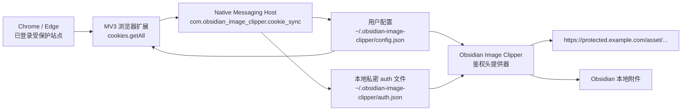

# Obsidian Image Clipper 中文说明

[English README](./README.md)

这是一个面向 Obsidian 的鉴权图片本地化方案，用来解决受保护站点或权限控制严格的内网站点文章剪藏后，正文图片仍然指向远程 `https://protected.example.com/asset/...`，并且因为缺少浏览器登录态而无法被 Local Images Plus 正常下载的问题。

本项目基于 [Local Images Plus](https://github.com/Sergei-Korneev/obsidian-local-images-plus) 做 fork 式改造，新增了浏览器 Cookie 同步、Native Messaging 本地写入、Obsidian 鉴权下载和诊断能力。

## 从这里开始

如果是安装发布版本，先看 [快速开始](./docs/quickstart_zh-CN.md)。第一版只支持 macOS + Chrome 或 Microsoft Edge。

最短路径是：

1. 下载 GitHub Release artifact。
2. 把 `browser-extension/` 作为未打包扩展加载到 Chrome 或 Edge。
3. 使用加载后的扩展 ID 安装 macOS Native Messaging Host。
4. 把 `obsidian-image-clipper/` 安装到 Obsidian vault。
5. 打开受保护网页，添加当前 hostname，授权并刷新 Cookie。
6. 在 Obsidian 里对受保护图片 URL 运行诊断，然后执行本地化。

## 解决的问题

Obsidian Web Clipper 抓取受保护文章后，图片通常仍保留为远程链接：

```text
https://protected.example.com/asset/...
```

这些图片资源需要浏览器登录态或严格权限校验。普通 Obsidian 插件在下载远程图片时不会自动携带浏览器 Cookie，所以请求可能被重定向到登录页，最终拿到 HTML，而不是图片二进制内容。

本项目的处理方式是：

- 浏览器扩展读取配置域名列表的 Cookie。
- Native Messaging Host 把 Cookie 写入本地私密 auth 文件。
- Obsidian 插件下载图片时读取 auth 文件。
- 只有 URL hostname 与配置域名精确相等时才注入 Cookie/Referer。
- 如果响应像 HTML 登录页，插件会拒绝写入附件并给出诊断信息。
- 对公开图片继续沿用 Local Images Plus 原来的下载、重试、MD5 命名、附件目录和链接替换逻辑。

## 项目文档

- [快速开始](./docs/quickstart_zh-CN.md)
- [卸载说明](./docs/uninstall_zh-CN.md)
- [贡献指南](./CONTRIBUTING.md)
- [安全策略](./SECURITY.md)
- [变更记录](./CHANGELOG.md)
- [架构说明](./docs/architecture_zh-CN.md)

## 项目结构

```text
.
├── apps/
│   ├── browser-extension/     # Chrome/Edge Manifest V3 扩展
│   ├── native-host/           # macOS Native Messaging Host
│   └── obsidian-plugin/       # 基于 Local Images Plus 的 Obsidian 插件
├── packages/
│   └── shared/                # auth schema、校验、域名匹配、响应识别
├── scripts/                   # 构建和安装脚本
├── tests/                     # Vitest 单元测试
└── dist/                      # 构建后的运行产物和发布包
```

## 架构设计



浏览器扩展不能静默写任意本地文件。Chrome/Edge 这类浏览器要求扩展通过 Native Messaging 与本地程序通信。因此完整链路分成三个运行时组件：

- 浏览器扩展：读取当前浏览器 profile 中适用于用户配置域名列表的 Cookie。
- Native Host：校验请求，读写集中用户配置，并把 auth 文件写到本地用户配置目录。
- Obsidian 插件：先读取集中用户配置，再读取本地 auth 文件，在下载配置域名列表下的图片时注入 Cookie/Referer。

## 安全边界

这个实现刻意保持很窄的权限范围：

- 只支持精确域名匹配。默认不会配置任何受保护域名；界面里的 `protected.example.com` 只作为格式提示。
- 不接受 `*` 这类 wildcard 配置。
- 不接受带协议、端口、路径的 domain 配置。
- 浏览器扩展只会为用户配置的精确域名请求 Chrome/Edge host permission。
- 在普通 `http` 或 `https` 页面打开扩展时，它可以预填当前页面 hostname，但只有用户点击添加/保存后才会写入配置。
- 面向用户的配置默认集中在一个文件：

```text
~/.obsidian-image-clipper/config.json
```

- Cookie 不写入 Obsidian 设置、vault 笔记、插件源码或日志。
- 默认 auth 文件位于 vault 之外：

```text
~/.obsidian-image-clipper/auth.json
```

- Native Host 写入 auth 文件时设置权限为 `0600`。
- Obsidian 插件只在 `new URL(imageUrl).hostname === rule.domain` 时注入鉴权头。
- HTML、文本、JSON、疑似登录页响应会被拒绝，不会被保存成附件。

## 环境要求

- macOS。
- Chrome 或 Microsoft Edge。
- Obsidian Desktop。
- Node.js 与 npm。
- 当前浏览器 profile 已登录对应的受保护站点或内网站点。

第一版暂不覆盖 Windows、Linux、Firefox、无头浏览器或多浏览器 profile。

## 构建

在仓库根目录执行：

```bash
npm install
npm run build
```

主要构建产物：

```text
dist/browser-extension/
dist/native-host/obsidian-image-clipper-cookie-host.js
dist/obsidian-plugin/
```

验证命令：

```bash
npm test
npm run typecheck
```

## 使用步骤

### 1. 加载浏览器扩展

打开浏览器扩展管理页：

- Chrome：`chrome://extensions`
- Edge：`edge://extensions`

然后：

1. 打开开发者模式。
2. 选择加载未打包扩展。
3. 选择目录：

```text
dist/browser-extension
```

4. 记录扩展 ID。安装 Native Host 时需要这个 ID。

### 2. 安装 macOS Native Host

加载扩展后，在仓库根目录执行：

```bash
npm run install:native-host:macos -- --browser=chrome --extension-id=<loaded-extension-id>
```

或 Edge：

```bash
npm run install:native-host:macos -- --browser=edge --extension-id=<loaded-extension-id>
```

安装脚本会写入：

- Chrome/Edge Native Messaging manifest。
- 集中用户配置：

```text
~/.obsidian-image-clipper/config.json
```

- Native Host 元数据：

```text
~/.obsidian-image-clipper/native-host-settings.json
```

安装脚本不会写入 Cookie。Cookie 只有在浏览器扩展执行刷新时才会写入。

### 3. 配置受保护域名列表

集中配置文件是：

```text
~/.obsidian-image-clipper/config.json
```

默认内容：

```json
{
  "version": 1,
  "protectedDomains": [],
  "cookieSyncEnabled": true,
  "refreshIntervalMinutes": 30,
  "authDownloadsEnabled": true,
  "authConfigPath": "~/.obsidian-image-clipper/auth.json",
  "authConfigStaleMinutes": 120
}
```

可以通过扩展界面添加域名，也可以手动编辑 `protectedDomains`，例如 `kb.example.com` 和 `assets.example.com`。不要写 `https://`、路径、端口或 wildcard。

配置可以双向同步：

- 手动编辑 `config.json` 后，在扩展设置页点击 `Reload config.json`。
- 在扩展设置页修改后，点击 `Save and grant access`，扩展会写回同一个 `config.json`。
- 在受保护页面打开扩展时，可以预填当前页面 host，但仍需用户显式添加/保存。

### 4. 刷新 Cookie

1. 在同一个浏览器 profile 中打开每个已配置的受保护站点。
2. 确认每个需要 Cookie 的站点都已经登录。
3. 打开浏览器扩展弹窗。
4. 点击 `Refresh now`。

成功后会生成：

```text
~/.obsidian-image-clipper/auth.json
```

该文件会为每个同步成功的域名写入一条 domain rule，包含 Cookie header、Referer 和更新时间。

### 5. 安装 Obsidian 插件

插件构建产物位于：

```text
dist/obsidian-plugin/
```

将该产物作为 Obsidian 插件目录安装，目录名为：

```text
obsidian-image-clipper
```

目标路径形如：

```text
<your-vault>/.obsidian/plugins/obsidian-image-clipper/
```

目录内应包含：

```text
main.js
manifest.json
styles.css
```

然后重启 Obsidian 或重新加载社区插件，并启用 `Obsidian Image Clipper`。

### 6. 本地化受保护图片

打开包含受保护图片的笔记，执行插件命令：

- `Localize attachments for the current note (plugin folder)`
- `Localize attachments for the current note (Obsidian folder)`
- `Localize attachments for all your notes (plugin folder)`

公开图片仍走 Local Images Plus 原逻辑。对于配置域名列表下的图片，插件会读取本地 auth 文件并注入匹配的 Cookie/Referer。

## Obsidian 插件设置

插件设置页新增 `Authenticated downloads` 区域：

- `Enable authenticated downloads`：是否启用鉴权下载。
- `Auth config file`：本地 auth 文件路径。保持默认值时会跟随 `config.json`。
- `Stale threshold`：诊断时判断 auth 文件可能过期的分钟数。使用默认路径时会采用集中配置里的 `authConfigStaleMinutes`。
- `Diagnostics URL`：当编辑器没有选中 URL 时，诊断命令使用的备用 URL。

新增命令：

- `Diagnose authenticated image URL`
- `Import Local Images Plus settings`

旧设置导入命令会读取：

```text
<vault>/.obsidian/plugins/obsidian-local-images-plus/data.json
```

它只导入非敏感设置，不导入 Cookie、headers 或任何鉴权 secret。

## Auth 文件格式

Native Host 写入的 auth config 版本为 `1`：

```json
{
  "version": 1,
  "updatedAt": "2026-06-11T09:30:00.000Z",
  "rules": [
    {
      "domain": "protected.example.com",
      "headers": {
        "Cookie": "name=value; another=value",
        "Referer": "https://protected.example.com/"
      },
      "expiresAt": "2026-06-12T09:30:00.000Z",
      "source": {
        "browser": "chrome",
        "extensionId": "..."
      }
    },
    {
      "domain": "assets.example.com",
      "headers": {
        "Cookie": "asset_session=value",
        "Referer": "https://assets.example.com/"
      },
      "source": {
        "browser": "chrome",
        "extensionId": "..."
      }
    }
  ]
}
```

以下配置会被拒绝：

- `*` wildcard。
- `https://protected.example.com` 这类带协议的 domain。
- `protected.example.com:443` 这类带端口的 domain。
- `protected.example.com/asset` 这类带路径的 domain。
- `Cookie`、`Referer` 之外的 header。
- 重复 domain。

## 下载响应校验

很多鉴权失败并不会返回 HTTP 401/403，而是返回 HTTP 200 的 HTML 登录页。插件下载后会先做响应识别：

- 接受图片和二进制附件响应。
- 拒绝 HTTP 非 2xx 响应。
- 拒绝 `text/html`、疑似 HTML body、`text/plain`、JSON、非 SVG XML。
- 当 HTML 中出现 login/auth/sign-in/passport 等特征时，诊断会标记为疑似登录页。

这可以避免把登录页 HTML 保存成损坏的图片附件。

## 开发命令

```bash
npm run build
npm run build:plugin
npm run build:extension
npm run build:native-host
npm run package:release
npm test
npm run typecheck
```

根目录 `typecheck` 会覆盖所有 workspace。Obsidian 插件的兼容类型说明记录在 [docs/typecheck-limitations.md](./docs/typecheck-limitations.md)。

## Release Package

执行 `npm run build` 后，可以生成统一发布目录：

```bash
npm run package:release
```

输出目录：

```text
dist/release/obsidian-image-clipper-<version>/
```

其中包含 `browser-extension/`、`native-host/`、`obsidian-image-clipper/`、`artifact-manifest.json` 和简短的 `INSTALL.md`。

## 排错

### 扩展提示缺少权限

- 打开扩展设置页。
- 确认每个 `Protected domains` 条目都是纯 host，例如 `protected.example.com`。
- 点击 `Grant access`。
- 再次刷新 Cookie。

### 扩展提示没有找到 Cookie

- 确认同一个浏览器 profile 已打开每个已配置的受保护站点。
- 确认报错域名已经登录对应的受保护站点或内网站点。
- 点击扩展弹窗里的 `Refresh now`。
- 确认扩展加载在你实际登录的 Chrome/Edge 中。

### Native Host 找不到

- 重新运行 macOS 安装脚本。
- 确认 `--browser=chrome` 或 `--browser=edge` 与当前浏览器一致。
- 确认扩展 ID 是当前加载的扩展 ID。
- 确认已经执行过 `npm run build`。

### Native Host 访问被拒绝

- 这表示当前加载的扩展 ID 没有写入浏览器 Native Messaging manifest。
- 从 `chrome://extensions` 或 `edge://extensions` 复制当前扩展 ID。
- 用这个 ID 重新运行 macOS 安装脚本。
- 重新安装后，完全退出并重新打开 Chrome 或 Edge。

### Obsidian 诊断提示 auth 文件缺失

- 在浏览器扩展里执行 `Refresh now`。
- 检查插件设置里的 `Auth config file`。
- 检查默认路径是否存在：

```text
~/.obsidian-image-clipper/auth.json
```

### 下载结果像登录页

- 重新登录对应的受保护站点或内网站点。
- 在浏览器扩展里点击 `Refresh now`。
- 在 Obsidian 中选中失败的图片 URL，运行 `Diagnose authenticated image URL`。

### 公开图片下载异常

在插件设置里关闭 `Enable authenticated downloads`。公开图片下载应该继续沿用 Local Images Plus 的普通流程。

## 当前限制

- Native Host 安装脚本只支持 macOS。
- Cookie 同步只支持 Chrome/Edge。
- 鉴权匹配只支持 exact domain。
- 不支持 incognito。
