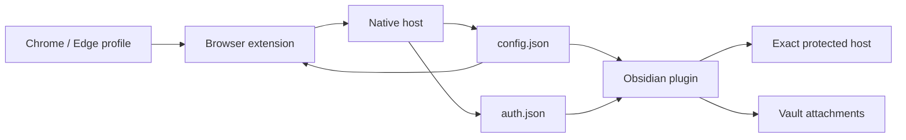

# Architecture

English | [中文](./architecture_zh-CN.md)

Obsidian Image Clipper is split into three runtime apps plus one shared package.

```text
apps/
  browser-extension/  Chrome/Edge Manifest V3 extension
  native-host/        macOS Native Messaging host
  obsidian-plugin/    Obsidian plugin based on Local Images Plus
packages/
  shared/             Config/auth schemas, domain matching, response validation
```

`packages/shared` intentionally stays under `packages/` so future shared packages can be added without reshaping the workspace.

## Runtime Flow



1. The browser extension reads cookies only after the user grants host permission for exact configured domains.
2. The native host validates and writes `~/.obsidian-image-clipper/config.json` and `auth.json` with owner-only permissions.
3. The Obsidian plugin reads the central config and auth file.
4. Auth headers are injected only when the image URL hostname exactly matches a configured rule.
5. HTML/login responses are rejected before attachment writing.

## Extension Points

- Browser adapter: Chrome/Edge now; Firefox later would need a different extension packaging and permission review.
- Native host adapter: macOS installer now; Windows/Linux need platform-specific manifest paths and launcher scripts.
- Auth header provider: Obsidian plugin currently reads local auth config; other clients can reuse `packages/shared` validation.
- Config/auth schema: `packages/shared` owns versioned schemas and exact-domain validation.
- Response validation: `packages/shared` classifies HTTP/image responses so clients avoid saving login pages as attachments.

## Security Boundaries

- Multi-domain means multiple exact hosts, not wildcard matching.
- Current-tab hostname detection is only a prefill convenience.
- Cookie values do not appear in extension metadata, user-facing health status, logs, or Obsidian settings.
- `dist/` is a build output and should be uploaded as a release artifact, not committed to source.

## Roadmap

- Windows and Linux native host installers.
- Firefox extension packaging if the permission model fits the same security boundary.
- Automated GitHub Release artifact upload and checksum generation.
- Richer first-run diagnostics in Obsidian after the browser/native flow is complete.
