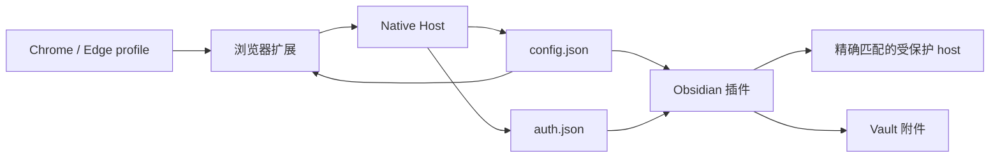

# 架构说明

[English](./architecture.md) | 中文

Obsidian Image Clipper 由三个运行时应用和一个共享包组成。

```text
apps/
  browser-extension/  Chrome/Edge Manifest V3 扩展
  native-host/        macOS Native Messaging Host
  obsidian-plugin/    基于 Local Images Plus 的 Obsidian 插件
packages/
  shared/             配置/auth schema、域名匹配、响应校验
```

`packages/shared` 保留在 `packages/` 下，是为了未来可以继续增加其他共享包，而不需要再次调整 workspace 结构。

## 运行流程



1. 用户为精确配置的域名授予 host permission 后，浏览器扩展才读取 Cookie。
2. Native Host 校验并写入 `~/.obsidian-image-clipper/config.json` 和 `auth.json`，文件权限为仅当前用户可读写。
3. Obsidian 插件读取集中配置和 auth 文件。
4. 只有图片 URL 的 hostname 与配置 rule 精确相等时，插件才注入鉴权 header。
5. HTML 登录页等非图片响应会在写入附件前被拒绝。

## 扩展点

- Browser adapter：当前支持 Chrome/Edge；未来 Firefox 需要单独处理扩展打包和权限模型。
- Native host adapter：当前支持 macOS installer；Windows/Linux 需要各自的 manifest 路径和启动脚本。
- Auth header provider：当前由 Obsidian 插件读取本地 auth config；其他客户端也可以复用 `packages/shared` 的校验逻辑。
- Config/auth schema：`packages/shared` 负责版本化 schema 和精确域名校验。
- Response validation：`packages/shared` 负责判断下载响应，避免客户端把登录页保存成附件。

## 安全边界

- 多域名表示多个精确 host，不表示 wildcard 匹配。
- 当前页面 hostname 检测只是预填便利，不会自动保存配置或授权。
- Cookie 值不会出现在扩展 metadata、用户可见健康状态、日志或 Obsidian 设置里。
- `dist/` 是构建产物，应作为 release artifact 上传，不进入源码仓库。

## 路线图

- Windows 和 Linux Native Host installer。
- 在权限模型合适的前提下支持 Firefox 扩展打包。
- 自动上传 GitHub Release artifact 并生成 checksum。
- 在浏览器/native 流程完成后，在 Obsidian 里提供更完整的首次运行诊断。
